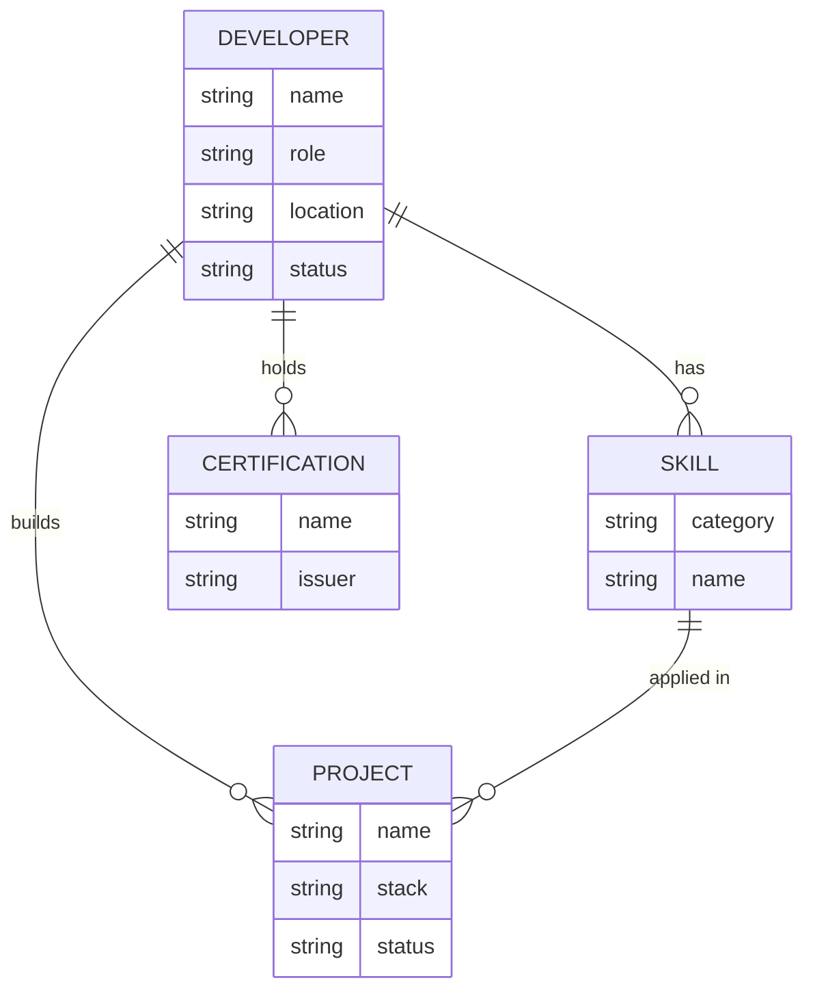
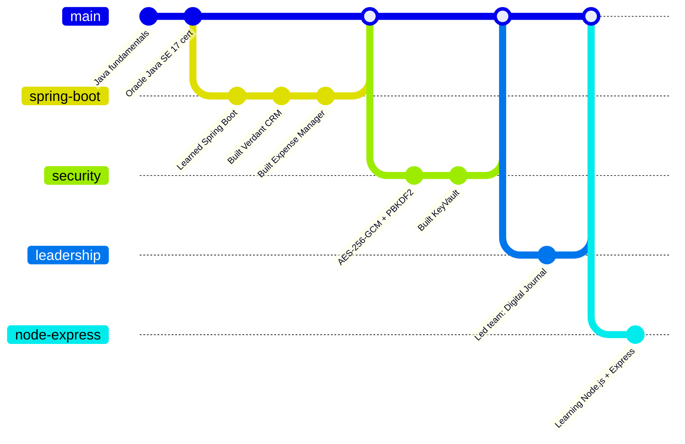

# Rahul E.
### Backend Developer — Java · Spring Boot · System Design

📍 Chennai, India &nbsp;·&nbsp; 🎓 SRM Easwari Engineering College, CSE '28 &nbsp;·&nbsp; ☕ Oracle Certified, Java SE 17

---

### Schema

I got into backend engineering by taking apart a tutorial CRUD app and asking what happens when it meets real traffic and real attackers. That question is still what I build toward — systems with real access control, real encryption, and a schema that was actually thought through.

---

### Skills

**Languages**
- &nbsp; Java
- &nbsp; JavaScript
- &nbsp; HTML
- &nbsp; CSS

**Backend & Data**
- &nbsp; Spring Boot
- &nbsp; Spring Data JPA / Hibernate
- &nbsp; Spring Security
- &nbsp; JWT
- &nbsp; MySQL
- &nbsp; PostgreSQL

**Security Layer**
- 🔐 AES-256-GCM
- 🔐 PBKDF2
- 🔐 RBAC
- 🔐 Web Crypto API

**Tooling**
- &nbsp; Git
- &nbsp; GitHub
- &nbsp; Postman
- &nbsp; Maven
- &nbsp; IntelliJ IDEA
- &nbsp; VS Code

**In progress**
- &nbsp; Node.js
- &nbsp; Express

---

### Projects

<b>🧭 Digital Journal — Team Lead, 5 engineers</b>

 

`Spring Boot` `PostgreSQL` `Alpine.js` `htmx` `AWS S3`

My first project-leadership role. Owned the system design docs, a phased build roadmap, and the frontend/backend integration contract for a team of five.

<b>🔐 KeyVault — Secrets & API Key Manager</b>

 

`Java` `Spring Boot` `MySQL` `Web Crypto API`

Client-encrypted secrets manager — PBKDF2 + AES-256-GCM encryption happens before anything reaches the backend. Workspaces, RBAC, secret versioning with rollback, audit logs, machine tokens, expiry alerts.

<b>📊 Verdant CRM — Commercial Operations Platform</b>

 

`Java 17` `Spring Boot 3` `PostgreSQL` `Flyway` `Spring Security`

Lead tracking, quoting, milestone-billing, and field-survey workflows. PostgreSQL materialized view for analytics, paginated REST via Pageable, Flyway migrations, JWT auth.

<b>💰 Expense Manager — Full-Stack Finance Tracker</b>

 

`Java` `Spring Boot` `MySQL` `JPA` `HTML/CSS/JS`

Recurring expense tracking with budget calculations, category filtering, and aggregate SQL queries behind a dynamic async UI.

---

### Growth

---

### Stats

400+ LeetCode problems solved · 1503 CodeChef rating (Div 3)

---

Always building something. Reach out about backend systems, security, or SaaS ideas.
  

